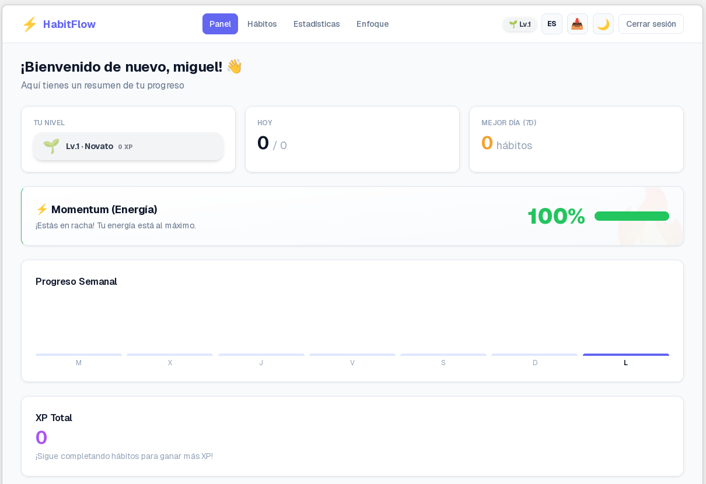
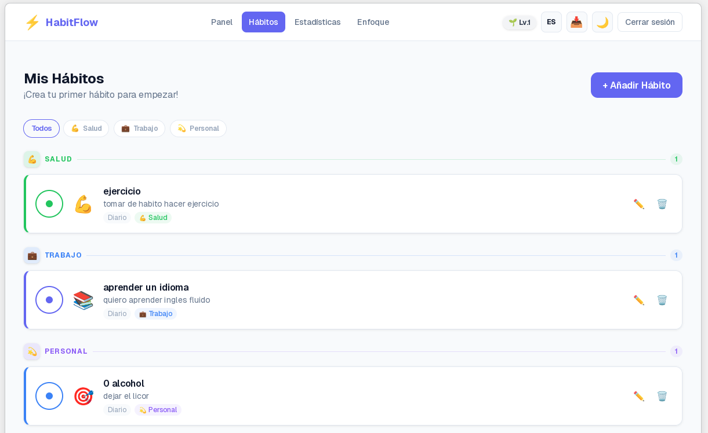
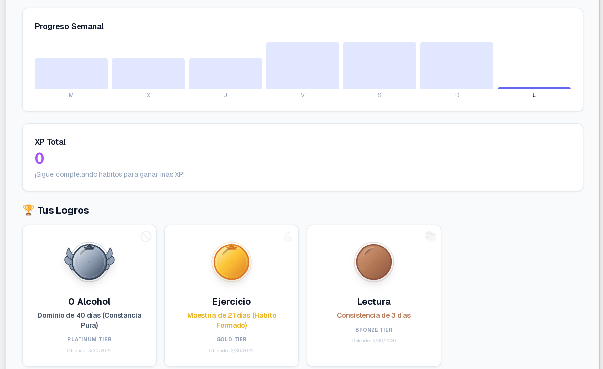

# 🚀 HabitFlow - Gestor de Hábitos Gamificado

<div align="center">


**HabitFlow** es un gestor de hábitos diarios con enfoque en gamificación visual y experiencia de usuario. A diferencia de trackers tradicionales basados en listas, ofrece una vista de "jornada" horizontal donde el usuario visualiza su progreso a lo largo del día, con efectos de animación al completar tareas y un sistema de rachas que motiva la consistencia.

</div>

<div align="center">

**"HabitFlow no solo rastrea tus hábitos, los hace ADICTIVOS a través de las mecánicas de juego"**

</div>

---

## 📋 Tabla de contenido

- [🌟 Características](#-características)
- [🛠️ Tech Stack](#-tech-stack)
- [📸 Capturas de Pantalla](#-capturas-de-pantalla)
- [💻 Desarrollo Local](#-desarrollo-local)
- [📚 API Documentation](#-api-documentation)
- [🎮 Gamificación](#-gamificación)
- [📄 Licencia](#-licencia)

---

## 🌟 Características

### MVP (Must Have)

| # | Característica | Descripción |
|---|----------------|-------------|
| ✅ | **Autenticación JWT** | Registro/login seguro con email y contraseña, tokens de acceso y refresh |
| ✅ | **CRUD de Hábitos** | Crear, editar, eliminar hábitos con nombre, descripción, frecuencia e icono |
| ✅ | **Marcar Completado** | Checkbox con animación al completar hábito |
| ✅ | **Vista de Hoy** | Timeline horizontal mostrando hábitos del día |
| ✅ | **Sistema de Rachas** | Contador de días consecutivos cumpliendo hábitos |
| ✅ | **Dashboard** | Resumen visual de progreso semanal con gráficos animados |

### Features Adicionales

| # | Característica | Descripción |
|---|----------------|-------------|
| ✅ | **Categorías** | Agrupar hábitos por tipo (salud, trabajo, personal) |
| ✅ | **Sistema de Niveles** | XP por completar hábitos, nivel de usuario automático |
| ✅ | **Dark/Light Mode** | Tema visual oscuro/claro conmutables |
| ✅ | **Logros/Achievements** | Sistema de medalas por progreso en hábitos |
| ✅ | **Focus Sessions** | Sesiones Pomodoro con recompensas XP |
| ✅ | **WebSockets** | Sincronización en tiempo real |
| ✅ | **Exportación de Datos** | Exportar datos de usuario en JSON |
| ✅ | **Estadísticas Avanzadas** | Analytics con métricas detalladas |
| ✅ | **Multiidioma** | Soporte para español e inglés |
| ✅ | **Rate Limiting** | Protección contra abusos |

---

## 🛠️ Tech Stack

### Backend

- **Framework:** FastAPI
- **ORM:** SQLModel
- **Base de datos:** PostgreSQL
- **Auth:** JWT (python-jose) + pwdlib (argon2)
- **Migrations:** Alembic
- **Validación:** Pydantic
- **WebSockets:** FastAPI WebSocket
- **Rate Limiting:** SlowAPI

### Frontend

- **Framework:** Next.js 15 (React 19)
- **Estado:** Zustand
- **Data Fetching:** React Query (TanStack Query)
- **Estilos:** TailwindCSS
- **Routing:** App Router (Next.js)
- **HTTP Client:** Axios

### Despliegue

- **Plataforma:** CubePath
- **Contenedores:** Docker + Docker Compose

---

## 📸 Capturas de Pantalla

### Dashboard Principal


### Vista de Hábitos


### Sistema de Logros


---

## 💻 Desarrollo Local

### Requisitos

- Python 3.11+
- Node.js 18+
- Docker (opcional, para base de datos)

### Setup Backend (con UV)

```bash
cd backend

# Instalar dependencias directamente con UV (sin entorno virtual explícito)
uv pip install -r requirements.txt

# O si usas pyproject.toml:
uv pip install -e .

# Configurar variables de entorno
cp .env.example .env
# Edita .env con tu configuración

# Ejecutar migraciones
alembic upgrade head

# Iniciar servidor
uvicorn app.main:app --reload
```

El backend estará disponible en `http://localhost:8000`

> **Nota:** Este proyecto usa [UV](https://github.com/astral-sh/uv) en lugar de pip tradicional para mayor velocidad y eficiencia.

### Setup Frontend

```bash
cd frontend

# Instalar dependencias
npm install

# Configurar variables de entorno
cp .env.local.example .env.local
# Edita .env.local con la URL del API

# Iniciar servidor de desarrollo
npm run dev
```

El frontend estará disponible en `http://localhost:3000`

### Docker Compose (Todo junto)

```bash
# Iniciar todos los servicios
docker-compose up -d

# Ver logs
docker-compose logs -f

# Detener servicios
docker-compose down
```

---

## 📚 API Documentation

Una vez que el backend esté ejecutándose, visita:

- **Swagger UI:** `http://localhost:8000/docs`
- **ReDoc:** `http://localhost:8000/redoc`

### Endpoints Principales

| Método | Endpoint | Descripción |
|--------|----------|-------------|
| POST | `/api/auth/register` | Registrar nuevo usuario |
| POST | `/api/auth/login` | Iniciar sesión |
| POST | `/api/auth/refresh` | Renovar token de acceso |
| GET | `/api/auth/me` | Obtener datos del usuario actual |
| GET | `/api/habits/` | Listar todos los hábitos |
| POST | `/api/habits/` | Crear nuevo hábito |
| PUT | `/api/habits/{id}` | Actualizar hábito |
| DELETE | `/api/habits/{id}` | Eliminar hábito |
| POST | `/api/progress/{id}/toggle` | Marcar hábito completado |
| GET | `/api/progress/summary` | Obtener resumen del dashboard |
| GET | `/api/progress/weekly` | Obtener progreso semanal |
| GET | `/api/achievements` | Obtener logros del usuario |
| POST | `/api/progress/focus/reward` | Recompensa por sesión de enfoque |

---

## 🎮 Gamificación

### Sistema de XP

- **Completar hábito:** +10 XP
- **Sesión de enfoque:** +0.2 XP por minuto
- **Perder racha:** -10 XP

### Niveles

| Nivel | XP Requerido |
|-------|--------------|
| 1 | 0 |
| 2 | 500 |
| 3 | 1250 |
| 4 | 2250 |
| 5 | 3500 |
| 6 | 5000 |
| 7 | 6750 |
| 8 | 8750 |
| 9 | 11000 |
| 10 | 13500 |

### Logros

- Medallas por alcanzar rachas de 3, 7, 21, 40 y 60 días:
  - 🥉 **Bronze** - 3 días
  - 🥈 **Silver** - 7 días
  - 🥇 **Gold** - 21 días
  - 💎 **Platinum** - 40 días
  - 💠 **Diamond** - 60 días

---

## 📄 Licencia

MIT License - Proyecto desarrollado para el **Hackatón CubePath 2026**.

---

<div align="center">

**¡Feliz construcción de hábitos! 🎯**

Hecho con ❤️ para el Hackatón CubePath 2026 - **Mr HGdev**

</div>